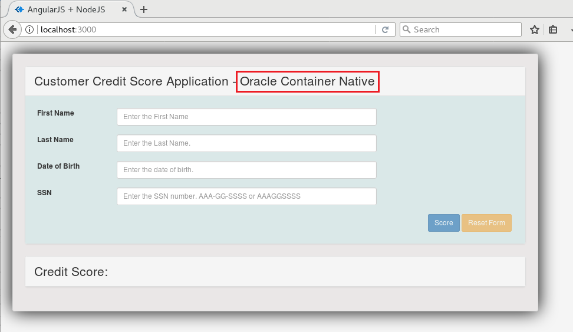
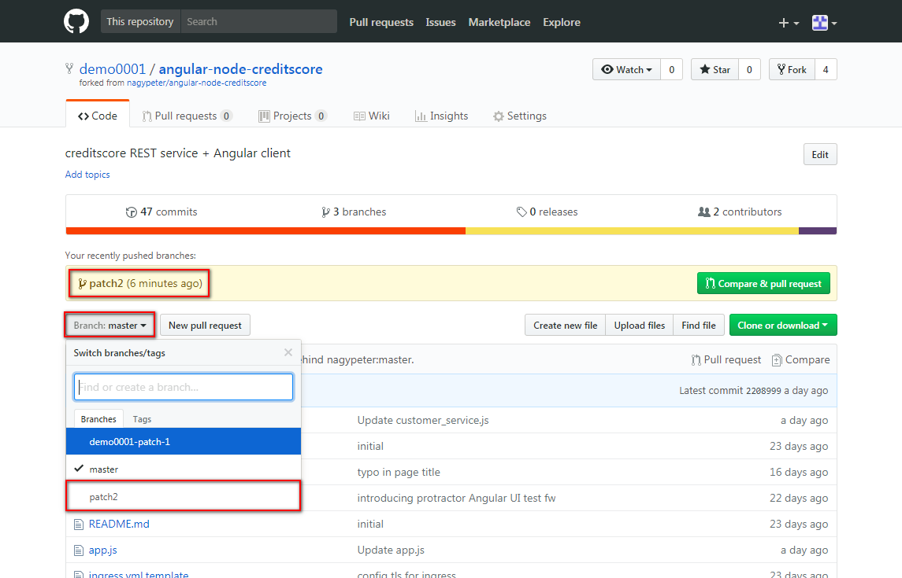
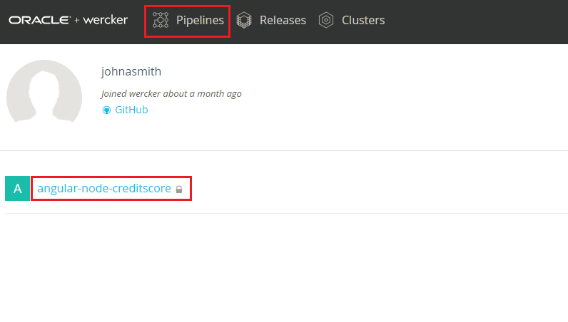
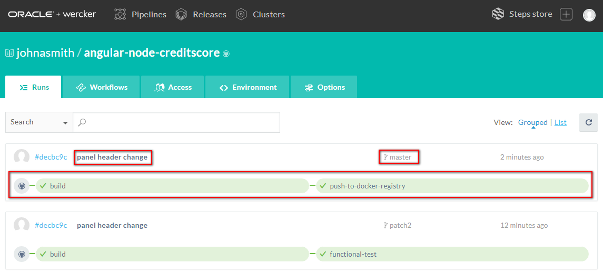
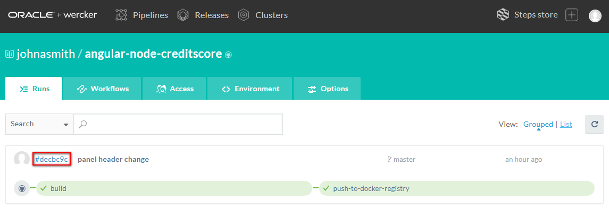
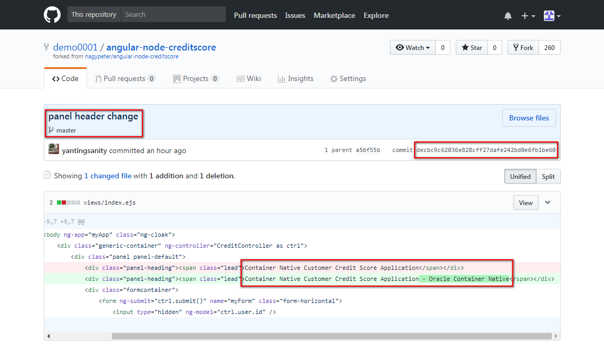

## Application Lifecycle Management - Desktop ##

Make sure you are signed in to [https://github.com](https://github.com) and [https://app.wercker.com](https://app.wercker.com). It is recommended to open two browser windows/tabs for [https://github.com](https://github.com) and [https://app.wercker.com](https://app.wercker.com) because you need to use both of them in parallel.

This use case for Application Lifecycle Management demonstrates the desktop development using *git* client and Oracle Container Pipelines (OCP) command line interface. The scenario is the following:

1. Create local clone of the source repository.
2. Create new branch for application patch.
3. Change the source code.
4. Build (using OCP cli) and test (using Docker) the application locally.
5. Commit changes on branch.
6. Check the OCP workflow result.
7. Merge and commit changes to master branch.
8. Pull the new image from Oracle Container Releases (OCR) and test using Docker

#### Prerequisites ####

- Git client. [https://git-scm.com/downloads](https://git-scm.com/downloads)
- Docker installed and running on your desktop. [https://docs.docker.com/engine/installation/](https://docs.docker.com/engine/installation/)

A pre installed Linux environment including the required components available in [VirtualBox image (cando.v3.1.ova)](https://drive.google.com/open?id=0B0MXC4qaECO6M3lxTGZ1RVZjd1k) format. For use the image needs to be downloaded and imported.

### Install Oracle Container Pipelines CLI (Linux) ###

open a terminal and use the following URL and `curl` command to download `wercker` CLI to `/usr/local/bin/`:

	$ sudo curl -L https://s3.amazonaws.com/downloads.wercker.com/cli/stable/linux_amd64/wercker -o /usr/local/bin/wercker
	  % Total    % Received % Xferd  Average Speed   Time    Time     Time  Current
	                                 Dload  Upload   Total   Spent    Left  Speed
	100 32.6M  100 32.6M    0     0  1742k      0  0:00:19  0:00:19 --:--:-- 2068k
	
Add the execution right:

	$ sudo chmod +x /usr/local/bin/wercker

Test the CLI using the *version* command. If new version available the application can update itself, but requires approval.
	
	[oracle@localhost ~]$ wercker version
	Version: 1.0.1062
	Compiled at: 2017-11-28 05:39:03 -0500 EST
	Git commit: d1e4586a9263e965c8d53be74031645dc08e99cc
	A new version is available: 1.0.1189 (Compiled at: 2018-04-04T10:23:04Z, Git commit: 47dcf9ce5d4f673a20a2bef7c06af22dd7cda210)
	Download it from: https://s3.amazonaws.com/downloads.wercker.com/cli/stable/linux_amd64/wercker
	Would you like update? [yN]
	y
	Downloading version 1.0.1189
	 32.57 MB / 32.89 MB [================================================================================================]  99.04% 0s[oracle@localhost ~]$ 

For Mac installation visit [http://devcenter.wercker.com/docs/cli/installation](http://devcenter.wercker.com/docs/cli/installation). Currently Windows installer is not available.

### Create local clone of the source repository ###

To create local clone of your remote repository execute the following `git` command in a folder where you have right and want to download. Please change the git URL (https://github.com/GITHUB_USERNAME/angular-node-creditscore.git) according to username:

	git clone https://github.com/johnasmith/angular-node-creditscore.git
	Cloning into 'angular-node-creditscore'...
	remote: Counting objects: 283, done.
	remote: Compressing objects: 100% (102/102), done.
	remote: Total 283 (delta 35), reused 95 (delta 18), pack-reused 163
	Receiving objects: 100% (283/283), 4.45 MiB | 1.86 MiB/s, done.
	Resolving deltas: 100% (128/128), done.

Change to the directory *angular-node-creditscore*:

	$ cd angular-node-creditscore	

### Modify the application ###

Each time when a developer wants to commit a bug or a feature, it is recommended to create a new branch for it, which will be a copy of your master (or other) branch. When the feature or fix is ready and tested the developers promote the changes to the master (or other which actually acts as parent) branch.

Create a new branch called e.g. **patch2**:

	$ git checkout -b patch2
	Switched to a new branch 'patch2'

Do the necessary changes. Now just modify the application UI page's text. Open the `views/index.ejs` file in your favourite editor (e.g. `vi`):

	vi views/index.ejs

Add to the panel header (in line 12) e.g. the *Oracle Container Native* text: 

	
Customer Credit Score Application - Oracle Container Native

Save the changes. Use `git status` to check the changes:

	$ git status
	# On branch patch2
	# Changes not staged for commit:
	#   (use "git add <file>..." to update what will be committed)
	#   (use "git checkout -- <file>..." to discard changes in working directory)
	#
	#	modified:   views/index.ejs
	#
	# Untracked files:
	#   (use "git add <file>..." to include in what will be committed)
	#
	#	.wercker/
	no changes added to commit (use "git add" and/or "git commit -a")

Before commit even to private local branch test the change. Use `wercker build` command to execute  **build** pipeline (defined in *wercker.yml*) on the desktop:

	$ wercker build --commit local.creditscore
	--> No Docker host specified, checking: /var/run/docker.sock
	--> Executing pipeline
	--> Running step: setup environment
	Pulling from library/node: 6.10
	Digest: sha256:39c92a576b42e5bee1b46bd283c7b260f8c364d8826ee07738f77ba74cc5d355
	Status: Image is up to date for node:6.10
	--> Copying source to container
	--> Running step: wercker-init
	--> Running step: A step that executes `npm install` command
	npm info it worked if it ends with ok
	npm info using npm@3.10.10
	npm info using node@v6.10.3
	npm info attempt registry request try #1 at 12:25:16 AM
	npm http request GET https://registry.npmjs.org/express
	npm info attempt registry request try #1 at 12:25:16 AM
	...
	...
	...
	npm info lifecycle angular-node@0.0.1~postinstall: angular-node@0.0.1
	npm info lifecycle angular-node@0.0.1~prepublish: angular-node@0.0.1
	npm info ok 
	angular-node@0.0.1 /pipeline/source
	+-- ejs@2.5.7 
	`-- express@3.2.6 
	  +-- buffer-crc32@0.2.1 
	  +-- commander@0.6.1 
	  +-- connect@2.7.11 
	  | +-- bytes@0.2.0 
	  | +-- cookie@0.0.5 
	  | +-- formidable@1.0.14 
	  | +-- pause@0.0.1 
	  | +-- qs@0.6.5 
	  | `-- send@0.1.1 
	  |   `-- mime@1.2.11 
	  +-- cookie@0.1.0 
	  +-- cookie-signature@1.0.1 
	  +-- debug@3.1.0 
	  | `-- ms@2.0.0 
	  +-- fresh@0.1.0 
	  +-- methods@0.0.1 
	  +-- mkdirp@0.3.4 
	  +-- range-parser@0.0.4 
	  `-- send@0.1.0 
	    `-- mime@1.2.6 
	
	--> Running step: Create TLS key and cert
	Generating a 2048 bit RSA private key
	..+++
	.........................................................................+++
	writing new private key to 'tls.key'
	-----
	--> Steps passed: 13.60s
	--> Pipeline finished: 14.60s

The **build** pipeline builds a Docker image. Check the image in the local repository:

	$ docker images
	REPOSITORY          TAG                 IMAGE ID            CREATED              SIZE
	local.creditscore   patch2              7436d6fc67ac        9 seconds ago        674MB
	node                6.10                3f3928767182        10 months ago       661MB

To test the containerized Credit Score Application you need to start the container. By default Docker containers can make connections to the outside world, but the outside world cannot connect to containers. If you want containers to accept incoming connections, you will need to provide `-p SPEC` option to explicitly define port mappings. In this case the application's default port #3000 will be bind to Docker host's port #3000:

	$ docker run -d -p3000:3000 local.creditscore:patch2 node /pipeline/source/app.js
	9ac483cb0a83ec4b6508121bd22a2010705e7ce7c61771126bd3d6c655011155

Now the container is running what you can verify to check the Docker processes and the container log.

	$ docker ps
	CONTAINER ID        IMAGE                      COMMAND                  CREATED              STATUS              PORTS                    NAMES
	9ac483cb0a83        local.creditscore:patch2   "node /pipeline/so..."   About a minute ago   Up 59 seconds       0.0.0.0:3000->3000/tcp   distracted_albattani
	$ $ docker logs 9ac483cb0a83
	Express server listening on port 3000

Please note for `docker logs` you need to provide CONTAINER_ID what you got using `docker ps`. The container and the application inside is running. Open a browser on your desktop and type: http://localhost:3000/

The application runs perfectly and the panel header has to be changed. Before move forward stop the running Docker container.

	$ docker ps
	CONTAINER ID        IMAGE                      COMMAND                  CREATED              STATUS              PORTS                    NAMES
	9ac483cb0a83        local.creditscore:patch2   "node /pipeline/so..."   About a minute ago   Up 59 seconds       0.0.0.0:3000->3000/tcp   distracted_albattani
	$ docker stop 9ac483cb0a83
	9ac483cb0a83

You can use CONTAINER ID and (funny, generated instance) NAME as stop parameter to identify the running image.

The next step is to push the **patch2** local branch to your remote repository on *github.com * what will trigger the Oracle Container Pipelines workflow to test the feature. First commit your changes to **patch2** branch than push to remote repository.

	$ git add views/index.ejs
	$ git commit -m "panel header change"
	[patch2 ea9b8f8] panel header change
	 Committer: oracle <oracle@localhost.localdomain>
	Your name and email address were configured automatically based
	on your username and hostname. Please check that they are accurate.
	You can suppress this message by setting them explicitly:
	
	    git config --global user.name "Your Name"
	    git config --global user.email you@example.com
	
	After doing this, you may fix the identity used for this commit with:
	
	    git commit --amend --reset-author
	
	 1 file changed, 2 insertions(+), 2 deletions(-)
	$ git push origin patch2
	Username for 'https://github.com': demo0001
	Password for 'https://johnasmith@github.com': 
	Counting objects: 7, done.
	Compressing objects: 100% (3/3), done.
	Writing objects: 100% (4/4), 369 bytes | 0 bytes/s, done.
	Total 4 (delta 2), reused 0 (delta 0)
	remote: Resolving deltas: 100% (2/2), completed with 2 local objects.
	To https://github.com/demo0001/angular-node-creditscore.git
	 * [new branch]      patch2 -> patch2
	
Now you can open browser window/tab sing in to [https://github.com](https://github.com) and check your repository. You have to see your new branch.

Sign in to [Oracle Container Pipelines](https://app.wercker.com) and check the result of the latest build what was triggered by **patch2** push. Select **Pipelines** and click on your application.

The latest build is related to *"panel header change"* and completes the non-master route of the workflow.

The result has to be successful. Now use *git* client to merge this feature to **master** branch. However usually there has to be an approval process to review the changes what a developer promote to the master branch, but now to simplify the use case the developer (you) are going to merge the tested changes. To do so first check your available branches then switch to **master**, merge **patch2** and push changes to **master** branch on the remote repository (*github.com*):

	$ git branch
	  master
	* patch2
	
	$ git checkout master
	Switched to branch 'master'
	
	$ git merge patch2
	Updating 2208999..fdf35b1
	Fast-forward
	 views/index.ejs | 4 ++--
	 1 file changed, 2 insertions(+), 2 deletions(-)
	$ git status
	# On branch master
	# Your branch is ahead of 'origin/master' by 1 commit.
	#   (use "git push" to publish your local commits)
	#
	nothing to commit, working directory clean
	
	$ git push origin master
	Username for 'https://github.com': demo0001
	Password for 'https://johnasmith@github.com': 
	Counting objects: 7, done.
	Compressing objects: 100% (3/3), done.
	Writing objects: 100% (4/4), 369 bytes | 0 bytes/s, done.
	Total 4 (delta 2), reused 0 (delta 0)
	remote: Resolving deltas: 100% (2/2), completed with 2 local objects.
	To https://github.com/demo0001/angular-node-creditscore.git
	   2208999..fdf35b1  master -> master	 

Open your browser again where [Oracle Container Pipelines](https://app.wercker.com) is opened and check the result of the latest build what was triggered by **master** push.

### Run containerized Credit Score sample application from Docker Hub ###

To test your production ready container packaged application run directly from the Docker Hub container registry. By default Docker Engine connects to Docker Hub registry (https://registry.hub.docker.com) so no need to set the desired registry configuration.

To run the latest version of container first you need to get the new tag for the latest container. Please note the tag is basically the corresponding hash of the commit which triggered the build. You can verify this assignment in the *wercker.yml* in the *push-to-dockerhub* pipeline definition:

	# pipeline to store container on Docker Hub
	push-to-dockerhub:
	    steps:
	      # Push to public docker repo
	      - internal/docker-push:
	          username: $DOCKER_USERNAME
	          password: $DOCKER_PASSWORD
	          tag:  $WERCKER_GIT_BRANCH-$WERCKER_GIT_COMMIT
	          repository: $DOCKER_USERNAME/$WERCKER_APPLICATION_NAME
	          registry: https://index.docker.io/v2/
	          cmd: node /pipeline/source/app.js

The tag number is constructed from the git branch name and the hash of the git commit. To get this string click on the **Run** tab in Oracle Pipelines and find the first part of the commit hash next to the name of the latest build. Click the string.

Find the full commit hash in the header of the merge details and note for the next step.

Once you have the commit hash construct the tag which has the following format: <BRANCH_NAME>-<COMMIT_HASH>. The branch name has to be *master*. Using the data above the tag is: `master-decbc9c62036e828cff27dafe242bd0e6fb1be60`. To run the modified application use *docker run* to pull and execute the specific (tagged) container packaged application locally on your desktop: `docker run -d -p3000:3000 YOUR_DOCKER_USERNAME/angular-node-creditscore:master-IMAGE_TAG_TO_BE_REPLACED` Don't forget to replace to your docker user name and the tag what you got in the previous step.

	[oracle@localhost ~]$ docker run -d -p3000:3000 demo0001/angular-node-creditscore:master-decbc9c62036e828cff27dafe242bd0e6fb1be60
	Unable to find image 'demo0001/angular-node-creditscore:master-decbc9c62036e828cff27dafe242bd0e6fb1be60' locally
	master-decbc9c62036e828cff27dafe242bd0e6fb1be60: Pulling from demo0001/angular-node-creditscore
	10a267c67f42: Already exists 
	fb5937da9414: Already exists 
	9021b2326a1e: Already exists 
	dbed9b09434e: Already exists 
	74bb2fc384c6: Already exists 
	9b0a326fab3b: Already exists 
	8089dfd0519a: Already exists 
	f2be1898eb92: Already exists 
	1dac9ca4e392: Pull complete 
	Digest: sha256:c5d62c35a640f49a1c8cf763787af01db14308a641c1da684e97bfef57731f8f
	Status: Downloaded newer image for demo0001/angular-node-creditscore:master-decbc9c62036e828cff27dafe242bd0e6fb1be60
	8c1a259fb08ec3e322c891336a133e69459c0748548b837a7f0e9c6e26f60647
	[oracle@localhost angular-node-creditscore]$ 

This version of image didn't exist locally so docker pulled from your Docker Hub repository. Using `docker ps` check the running container instance(s):

	$ docker ps
	CONTAINER ID        IMAGE                                                                               COMMAND                  CREATED             STATUS              PORTS                    NAMES
	8c1a259fb08e        demo0001/angular-node-creditscore:master-decbc9c62036e828cff27dafe242bd0e6fb1be60   "node /pipeline/sour…"   47 seconds ago      Up 45 seconds       0.0.0.0:3000->3000/tcp   hungry_banach

Open the application in your browser at [http://localhost:3000](http://localhost:3000) and fill the required test data and click **Score**.

Finally check the application's log using the `docker logs` command. You need the CONTAINER ID of your running container, thus first run `docker ps --format "table {{.ID}}\t{{.Image}}\t{{.Status}}"` using output format focusing on the neccessary information:

	$ docker ps --format "table {{.ID}}\t{{.Image}}\t{{.Status}}"
	CONTAINER ID        IMAGE                                                                               STATUS
	8c1a259fb08e        demo0001/angular-node-creditscore:master-decbc9c62036e828cff27dafe242bd0e6fb1be60   Up 2 minutes
	
	$ docker logs 8c1a259fb08e
	Express server listening on port 3000
	GET / 304 62ms
	GET /js/angular_app.js 200 73ms - 138b
	GET /js/controller/customer_controller.js 200 83ms - 834b
	GET /js/service/customer_service.js 200 83ms - 635b
	GET /stylesheets/app.css 200 87ms - 580b
	Request body: { id: null,
	  firstname: 'John',
	  lastname: 'Smith',
	  dateofbirth: '12/14/1977',
	  ssn: '332-48-9922',
	  score: '' }
	POST /creditscore 200 19ms - 98b

Compare the values in the log what you provided on the user interface.

Stop your container use `docker stop` and the ID of the running container:

	$ docker stop 8c1a259fb08e
	8c1a259fb08e

To remove your local images first use `docker images` to list available images on your desktop and get their IMAGE IDs or REPOSITORY:TAG what is necessary to delete. Execute the remove image command and specify which image you want to remove:

	$ docker images
	REPOSITORY                          TAG                                               IMAGE ID            CREATED             SIZE
	demo0001/angular-node-creditscore   master-decbc9c62036e828cff27dafe242bd0e6fb1be60   5368fce00080        About an hour ago   691MB
	local.creditscore                   patch2                                            e9472d086988        2 hours ago         693MB
	node                                6.10                                              3f3928767182        10 months ago       661MB	 
	
	$ docker rmi -f local.creditscore:patch2
	Untagged: local.creditscore:patch2
	Deleted: sha256:e9472d086988b375d015e59105feb4cae6d15fc516f25046b2619db48128110a

To clean up you may want to remove all other images. To remove all(!) local images use `docker rmi -f $(docker images -q)`.

	$ docker rmi -f $(docker images -q)
	Untagged: demo0001/angular-node-creditscore:master-decbc9c62036e828cff27dafe242bd0e6fb1be60
	Untagged: demo0001/angular-node-creditscore@sha256:c5d62c35a640f49a1c8cf763787af01db14308a641c1da684e97bfef57731f8f
	Deleted: sha256:5368fce00080eef16381f09e63e2274a1c50da57c8fd12687d1a82154c8f634e
	Untagged: node:6.10
	Untagged: node@sha256:39c92a576b42e5bee1b46bd283c7b260f8c364d8826ee07738f77ba74cc5d355
	Deleted: sha256:3f39287671828e60b8cc4c9643bad6ffac661de48f1ca8e48bbb2ef728f96356

