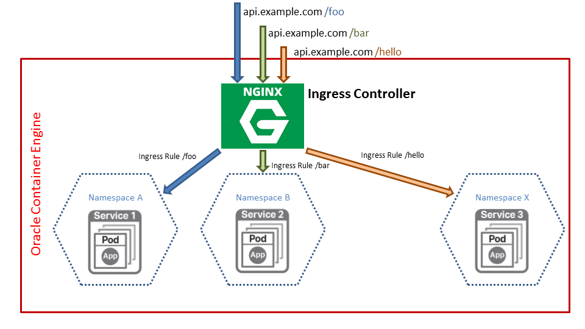
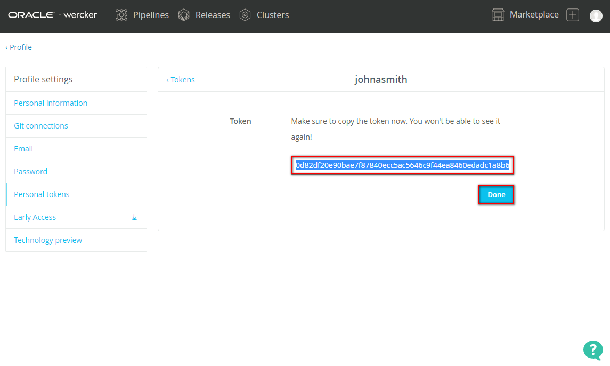
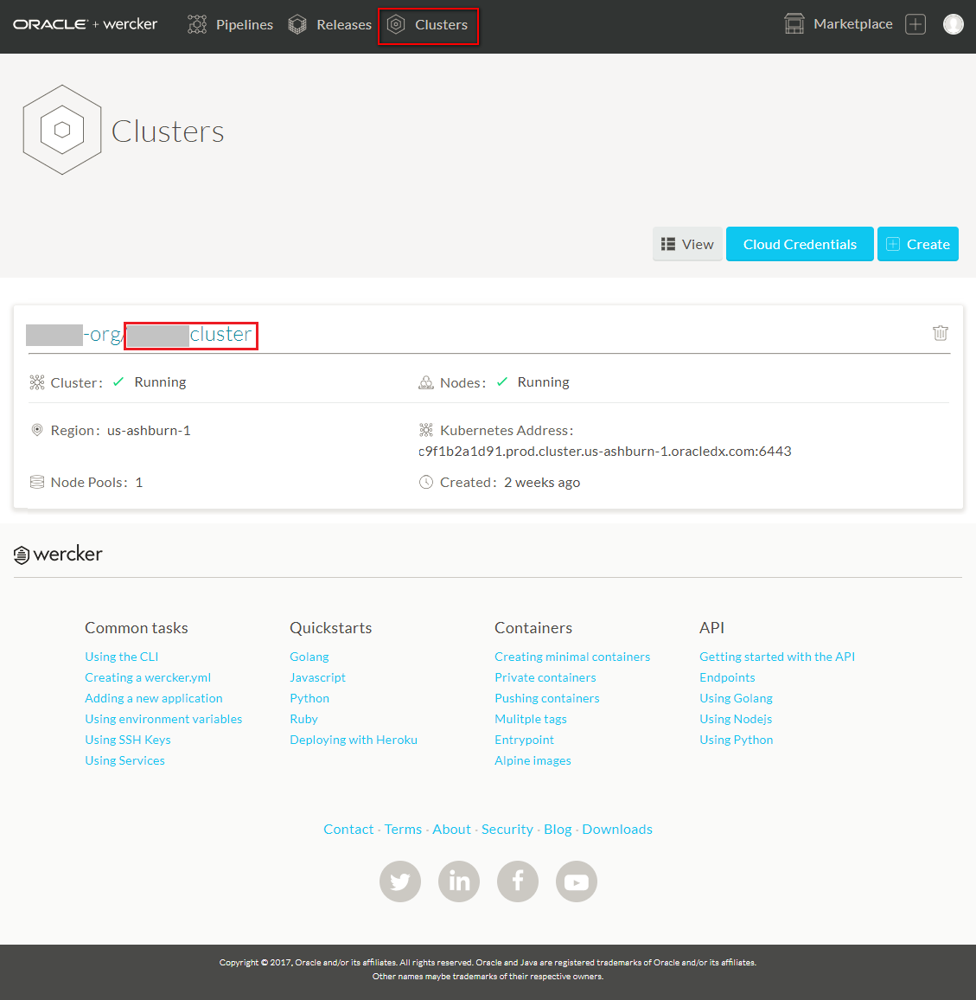
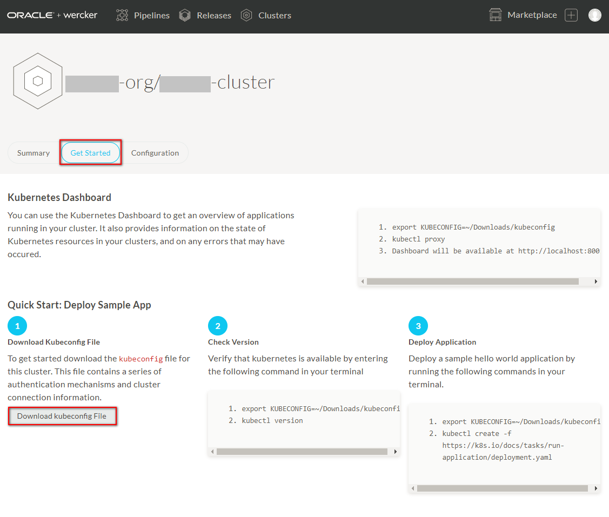

## Setting up Ingress Controller on your Oracle Container Engine ##

Due to the Load Balancer resource limitation, the recommended way to expose a service is the Ingress Controller applying Ingress Rules for every services. For more information visit: [https://kubernetes.io/docs/concepts/services-networking/ingress](https://kubernetes.io/docs/concepts/services-networking/ingress)

The Ingress Controller is composed of four parts:

1. **[Default backend deployment](https://github.com/nagypeter/kubernetes/blob/master/ingress/nginx-default-backend-deployment.yaml).** The default backend deployment handles default routes for healthchecks and 404 responses. This is done by using a stock image which serves the minimum required routes for a default backend.
2. **[Default backend service](https://github.com/nagypeter/kubernetes/blob/master/ingress/nginx-default-backend-service.yaml).** The default backend service exposes the default backend deployment for consumption by the ingress controller deployment.
3. **[Ingress controller deployment](https://github.com/nagypeter/kubernetes/blob/master/ingress/nginx-ingress-controller-deployment.yaml).** The Ingress Controller deployment deploys an image that contains the binary for the ingress controller and nginx. The binary manipulates and reloads the /etc/nginx/nginx.conf configuration file when an Ingress is created in Kubernetes. Nginx upstreams point to services which match specified selectors.
4. **[Ingress controller service](https://github.com/nagypeter/kubernetes/blob/master/ingress/nginx-ingress-controller-service.yaml).** The Ingress Controller service exposes the ingress controller deployment as a LoadBalancer type service. Because OKE uses a Bare Metal Cloud Services integration/cloud-provider, a load balancer will be dynamically created with the correct nodes configured as a backend set.

### Install and configure `kubectl` to access your Oracle Container Engine ###

To execute the setup script (*create-ingress.sh*) first you need to install and configure `kubectl` to access to your Oracle Container Engine instance (Kubernetes cluster). To configure `kubectl` and Oracle Container Pipelines (Wercker) you need an authentication token and *kubeconfig* which contains the connection specific information and settings.

To create your personal token open [https://app.wercker.com](https://app.wercker.com) (sign in if necessary) and click on your profile image at the top right corner of the page, select **Your profile** and click on **Manage settings**.

On the left side select the **Personal tokens** menu item. Define a token name e.g. your username and click **Generate**.

Make sure to copy your token because you won't be able to get it again! Click **Done**.

### Install Kubernetes command line interface and connect to Oracle Container Engine ###

#### Linux ####

Download the latest release with the following `curl` command:

	$ curl -LO https://storage.googleapis.com/kubernetes-release/release/$(curl -s https://storage.googleapis.com/kubernetes-release/release/stable.txt)/bin/linux/amd64/kubectl
	  % Total    % Received % Xferd  Average Speed   Time    Time     Time  Current
	                                 Dload  Upload   Total   Spent    Left  Speed
	100 49.9M  100 49.9M    0     0  4289k      0  0:00:11  0:00:11 --:--:-- 4150k

Make the kubectl binary executable.

	$ chmod +x ./kubectl

Move the binary in to your PATH.

	$ sudo mv ./kubectl /usr/local/bin/kubectl

Verify the installation using the version command.

	$ kubectl version
	Client Version: version.Info{Major:"1", Minor:"8", GitVersion:"v1.8.4", GitCommit:"9befc2b8928a9426501d3bf62f72849d5cbcd5a3", GitTreeState:"clean", BuildDate:"2017-11-20T05:28:34Z", GoVersion:"go1.8.3", Compiler:"gc", Platform:"linux/amd64"}
	The connection to the server localhost:8080 was refused - did you specify the right host or port?

At this step the server connection failure is normal. For easier usage it is recommended to setup the autocomplete for bash.

	$ source <(kubectl completion bash)

After the successful installation you need to get the kubeconfig configuration file belongs to your cluster. 

Change to browser where [https://app.wercker.com](https://app.wercker.com) openedand select **Clusters** and click on your cluster.

Click **Get Started** and **Download kubeconfig File**

When the the download finished open the *kubeconfig* file using your favourite text editor. The file content is something similar:

	apiVersion: v1
	clusters:
	- cluster:
	    certificate-authority-data: LS0tLS1CRUdJTiBDRVJUSUZJQ0FURS0tLS0tCk1JSURqRENDQW5TZ0F3SUJBZ0lVQkdzTE5JT1RzdXA4ODdnNjJ....
		kK3hpaGd4ZktSR29XS1oKLS0tLS1FTkQgQ0VSVElGSUNBVEUtLS0tLQo=
	    server: https://c9f1b2bbcs1.prod.cluster.us-ashburn-1.oracledx.com:6443
	  name: cluster-c9f1b2bbcs1
	contexts:
	- context:
	    cluster: cluster-c9f1b2bbcs1
	    user: user-c9f1b2bbcs1
	  name: context-c9f1b2bbcs1
	current-context: context-c9f1b2bbcs1
	kind: ""
	users:
	- name: user-c9f1b2bbcs1
	  user:
	    token: IAMABANANAQUiQkWoz6NqJLmsumxxr12xHStGWRTU.Hw3azCHsZ8yDvsYQHudnKRi0jgumaCiyK5OnQK5Pp1Q 

The *kubeconfig* file contains the necessary details and parameters to connect to Oracle Container Engine (Kubernetes cluster). The *clusters* parameter defines the available clusters. The minimum set of the properties are the address of the master node, the certification and it's name to refer. For later usage copy your server address. In the example above it is:*https://c9f1b2bbcs1.prod.cluster.us-ashburn-1.oracledx.com:6443*. The *users* parameter contains a generated temporary token which has has short expiration time. To avoid this expiration replace replace the *user token* to your private token what was generated in the previous step.

	  user:
	    token: 0d82df20e90bad4f8cd40ecc5ac5456c9f44238460edadc2a8b32108ce6bdf19

Save the updated *kubeconfig*. 

When execute a `kubectl` command first it tries to read the *kubeconfig* file from default location. For example on Linux it is `~/.kube`, but you can use *kubeconfig* file at different path and even with different name. Just set the configuration file location as KUBECONFIG environment variable in your command line terminal where you want to execute `kubectl` commands.

Linux:

	export KUBECONFIG=~/Downloads/kubeconfig

Now `kubectl` is ready to use. Test again using the version option.

	$ kubectl version
	Client Version: version.Info{Major:"1", Minor:"8", GitVersion:"v1.8.4", GitCommit:"9befc2b8928a9426501d3bf62f72849d5cbcd5a3", GitTreeState:"clean", BuildDate:"2017-11-20T05:28:34Z", GoVersion:"go1.8.3", Compiler:"gc", Platform:"linux/amd64"}
	Server Version: version.Info{Major:"1", Minor:"7+", GitVersion:"v1.7.4-2+af88312fe58fec", GitCommit:"af88312fe58fec576aed346d707bf58f0132ef2a", GitTreeState:"clean", BuildDate:"2017-10-24T20:06:27Z", GoVersion:"go1.8.3", Compiler:"gc", Platform:"linux/amd64"}
	$ 
 
Check the output, now it has to contain the server version information.

### Setup Ingress Controller ###

The setup script available at: [https://raw.githubusercontent.com/nagypeter/kubernetes/master/ingress/create-ingress.sh](https://raw.githubusercontent.com/nagypeter/kubernetes/master/ingress/create-ingress.sh) and can be executed directly. The script creates a namespace called *shared-ingress* and will create Ingress Controller resources within this namespace. If you need to change the namespace then modify NAMESPACE variable in [*create-ingress.sh*](https://github.com/nagypeter/kubernetes/blob/master/ingress/create-ingress.sh) script before execute. (To modify *create-ingress.sh* script use `git clone` to get local copy of the scripts and execute locally. Or fork the repository and modify using github Web UI. In case of last don't forget to modify `curl` command properly.)

	curl -LSs https://raw.githubusercontent.com/nagypeter/kubernetes/master/ingress/create-ingress.sh | sh

